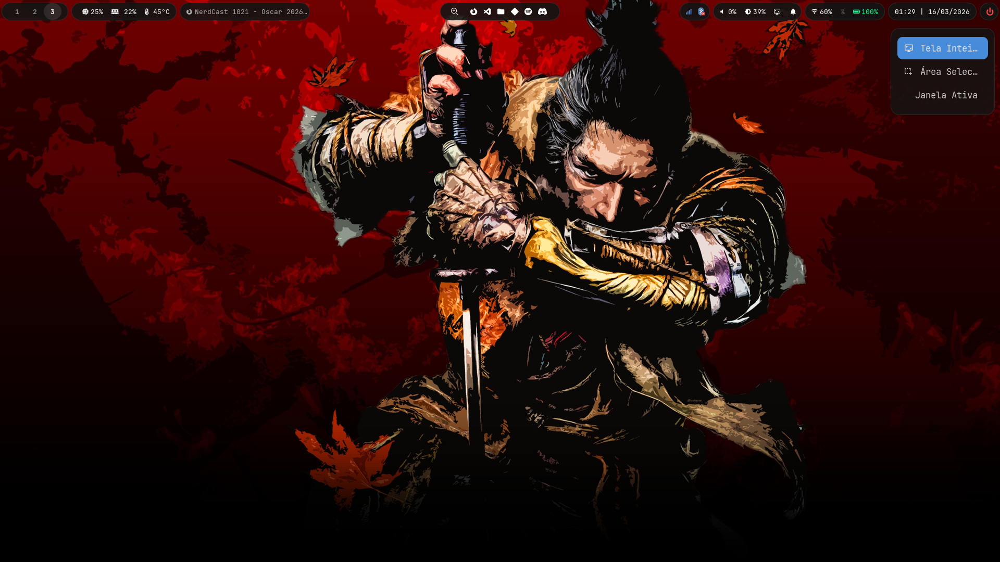
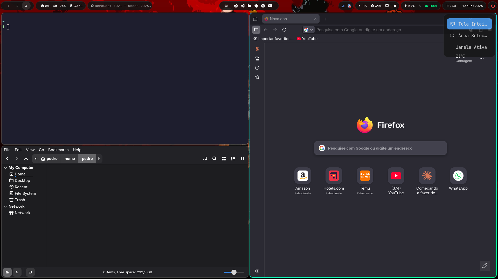

# Dotfiles - Pedro Cantarutti
## 📸 Preview



## 🖥️ Setup
- **OS:** Arch Linux
- **WM:** Hyprland
- **Bar:** Waybar
- **Terminal:** Kitty
- **Shell:** ZSH
- **Launcher:** Rofi
- **Notifications:** SwayNC
- **OSD:** SwayOSD
- **Wallpaper:** Waypaper + SWWW
- **Lock Screen:** Hyprlock + Swayidle
- **Login Manager:** SDDM + Sugar Candy
- **File Manager:** Nemo
## 🚀 Instalação
```bash
git clone https://github.com/PCantarutti/dotfiles.git
cd dotfiles
chmod +x install.sh
./install.sh
```
O script instala todas as dependências, copia as configs e habilita os serviços automaticamente.
## 📦 Dependências
### Pacman
```bash
# Instale o Hyprland primeiro
sudo pacman -S hyprland

# Depois as demais dependências
sudo pacman -S waybar kitty zsh rofi-wayland \
               hyprlock swayidle \
               swww nemo brightnessctl playerctl \
               bluez bluez-utils blueman \
               networkmanager network-manager-applet \
               pipewire wireplumber pamixer \
               grim slurp wl-clipboard \
               libnotify python-pywal \
               ttf-jetbrains-mono-nerd \
               xdg-desktop-portal xdg-desktop-portal-hyprland xdg-desktop-portal-gtk \
               adw-gtk-theme \
               wireless_tools wl-clipboard \
               gnome-software playerctl \
               gtk3 python-gobject flatpak
```
### AUR (yay)
```bash
yay -S swayosd-git swaync waypaper sddm-sugar-candy-git
```
## ⚙️ Após instalar
### Habilite os serviços:
```bash
sudo systemctl enable --now bluetooth
sudo systemctl enable --now NetworkManager
sudo systemctl enable --now swayosd-libinput-backend.service
sudo systemctl enable sddm
systemctl --user enable --now swayidle.service
```
### Configure o layout do teclado:
Edite `~/.config/hypr/hyprland.conf` e mude o bloco `input` para o layout do seu teclado.
```ini
input {
    kb_layout = br
}
```
### Adicione um wallpaper:
```bash
cp seu-wallpaper.jpg ~/wallpapers/
```
### Configure o tema do SDDM:
Edite `/usr/share/sddm/themes/sugar-candy/theme.conf` para personalizar cores, wallpaper e fonte da tela de login.
### Desative o power saving do WiFi (melhora performance):
```bash
sudo nano /etc/NetworkManager/conf.d/wifi-powersave.conf
```
```ini
[connection]
wifi.powersave = 2
```
## ⌨️ Atalhos principais
| Atalho | Ação |
|---|---|
| Super + T | Terminal (Kitty) |
| Super + B | Browser (Firefox) |
| Super + E | Gerenciador de arquivos (Nemo) |
| Super + L | Buscar e fixar apps no dock |
| Super + V | Editor de código (VSCode) |
| Super + W | Wallpaper (Waypaper) |
| Super + P | Screenshot |
| Super + C | Fechar janela |
| Super + F | Floating |
| Super + S | Workspace especial (scratchpad) |
| Super + Shift + S | Mover para scratchpad |
| Super + R | Pseudotile |
| Super + J | Toggle split |
| Super + Escape | Sair do Hyprland |
| Super + ← → ↑ ↓ | Mover foco |
| Super + 1-9 | Trocar workspace |
| Super + Shift + 1-9 | Mover janela para workspace |
| Super + Scroll | Trocar workspace |
| Super + LMB | Mover janela |
| Super + RMB | Redimensionar janela |
| Super + Shift + LMB | Redimensionar janela |
| Teclas Fn | Volume e brilho |
| Teclas mídia | Play/Pause/Próxima/Anterior |
## 📁 Estrutura
```
~/.config/
├── hypr/
│   ├── hyprland.conf
│   └── hyprlock.conf
├── waybar/
│   ├── config.jsonc
│   ├── style.css
│   └── scripts/
│       ├── wifi-menu.sh
│       ├── bluetooth-menu.sh
│       ├── power-menu.sh
│       ├── screenshot.sh
│       ├── media-info.sh
│       └── add-to-dock.sh
├── rofi/
│   ├── wifi-bluetooth.rasi
│   └── power-menu.rasi
├── swayosd/
│   └── style.css
├── swaync/
│   ├── config.json
│   └── style.css
├── kitty/
│   └── kitty.conf
├── sddm/
│   ├── sddm.conf
│   └── theme.conf
└── systemd/
    └── user/
        └── swayidle.service
```
