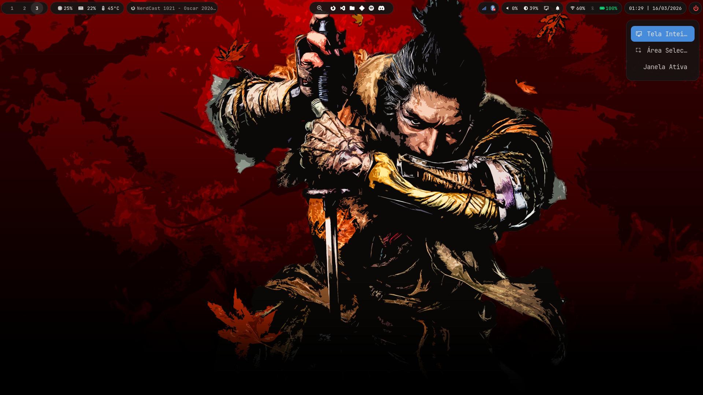
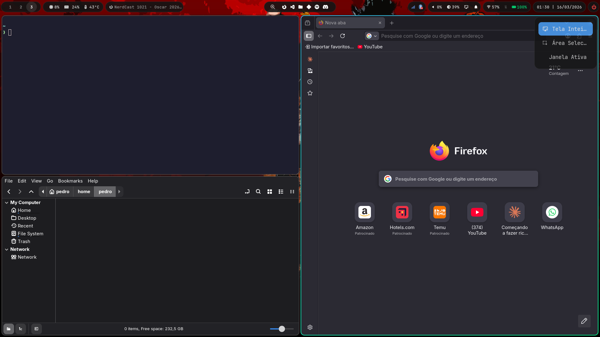
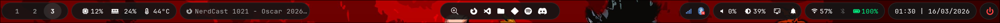

# 🌊 Hyprland Dotfiles - Pedro Cantarutti

Arch Linux agnostic rice. Roda em qualquer PC - o instalador detecta teclado, gera wallpaper fallback e ajusta caminhos automaticamente.

## 📸 Preview





## 🖥️ Setup

| Component | Software |
|---|---|
| **WM** | Hyprland |
| **Bar** | Waybar |
| **Terminal** | Kitty |
| **Shell** | ZSH + Starship |
| **Launcher** | Rofi-wayland |
| **Notifications** | SwayNC |
| **OSD** | SwayOSD |
| **Wallpaper** | Waypaper + swww |
| **Lock Screen** | Hyprlock |
| **Idle** | Swayidle (systemd user) |
| **Login Manager** | SDDM + Sugar Candy |
| **File Manager** | Nemo |
| **Audio** | PipeWire + WirePlumber |

## 🚀 Instalação rápida

```bash
git clone https://github.com/PCantarutti/dotfiles.git
cd dotfiles
chmod +x install.sh
./install.sh
```

O script:

1. Instala **yay** (AUR helper) se necessario
2. Instala todos os pacotes via **pacman** + **AUR**
3. Detecta o **layout de teclado** do sistema automaticamente
4. Copia todas as configs para `~/.config/`
5. Configura **wallpaper** automaticamente (ou gera fallback)
6. Remove monitores/devices hardcoded (auto-detect pelo Hyprland)
7. Configura e habilita **SDDM** com Sugar Candy
8. Habilita todos os **servicos systemd**
9. Configura **Flathub** e **WiFi power save**
10. Muda o shell para **ZSH**

## ⚙️ Pós-instalacao

Na maioria dos casos, so precisa reiniciar. Se quiser ajustar algo:

### Layout do teclado

O script ja detecta o layout automaticamente via `localectl`. Para trocar:

```ini
# ~/.config/hypr/hyprland.conf
input {
    kb_layout = us        # ou br, es, fr, de...
    kb_variant = intl     # varie conforme necessario
}
```

### Monitores

Monitores sao detectados automaticamente. Para forcar uma configuracao, adicione no topo de `~/.config/hypr/hyprland.conf`:

```ini
monitor=,preferred,auto,1          # todos os monitores: auto
# ou com valores explicitos:
monitor=HDMI-A-1,1920x1080@60,0x0,1
```

Use `wlr-randr` para ver os nomes das suas saidas de video.

### Wallpaper

Basta colocar imagens em `~/wallpapers/` e selecionar com **Waypaper** (`Super + W`):

```bash
# Ou via terminal
swww init
swww img ~/wallpapers/sua-imagem.png
```

### SDDM

Para personalizar a tela de login, edite:

```bash
sudo nano /usr/share/sddm/themes/sugar-candy/theme.conf
```

## ⌨️ Atalhos principais

| Atalho | Acao |
|---|---|
| Super + T | Terminal (Kitty) |
| Super + B | Browser (Firefox) |
| Super + E | Gerenciador de arquivos (Nemo) |
| Super + L | Buscar e fixar apps no dock |
| Super + V | Editor de codigo (VSCode) |
| Super + W | Wallpaper (Waypaper) |
| Super + P | Screenshot |
| Super + C | Fechar janela |
| Super + F | Toggle floating |
| Super + S | Workspace especial (scratchpad) |
| Super + Shift + S | Mover para scratchpad |
| Super + R | Pseudotile |
| Super + J | Toggle split |
| Super + Escape | Sair do Hyprland |
| Super + Tab | Hyprexpo (visao geral) |
| Super + D | Layout Dwindle |
| Super + M | Layout Master |
| Super + K | Swap focus with master |
| Super + ← → ↑ ↓ | Mover foco |
| Super + 1-9 | Trocar workspace |
| Super + Shift + 1-9 | Mover janela para workspace |
| Super + Scroll | Trocar workspace |
| Super + LMB | Mover janela |
| Super + RMB | Redimensionar janela |
| Super + Shift + LMB | Redimensionar janela |
| Teclas Fn | Volume e brilho |
| Teclas midia | Play/Pause/Próxima/Anterior |

## 📁 Estrutura

```
dotfiles/
├── install.sh
├── README.md
├── starship.toml
├── pavucontrol.ini
├── mimeapps.list
├── hypr/
│   ├── hyprland.conf       # config principal
│   ├── hypridle.conf
│   ├── hyprlock.conf
│   ├── hyprpaper.conf
│   └── scripts/lock.sh
├── waybar/
│   ├── config.jsonc
│   ├── style.css
│   └── scripts/
│       ├── wifi-menu.sh
│       ├── bluetooth-menu.sh
│       ├── power-menu.sh
│       ├── screenshot.sh
│       ├── media-info.sh
│       ├── add-to-dock.sh
│       └── media-widget.sh
├── rofi/
│   ├── wifi-bluetooth.rasi
│   ├── power-menu.rasi
│   └── add-to-dock.rasi
├── swaync/
│   ├── config.json
│   └── style.css
├── swayosd/
│   └── style.css
├── kitty/
│   └── kitty.conf
├── systemd/user/
│   └── swayidle.service
└── wallpapers/             # opcional
```
